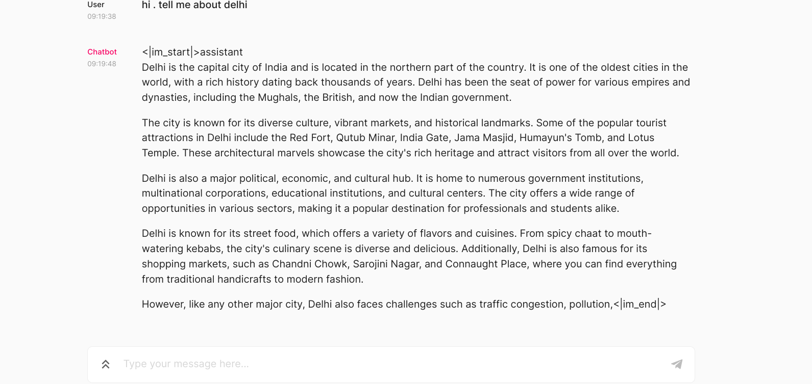

<p align="center"> 


</p>
<p><em>Hey there, Friend!
This project is still in the &quot;just for friends&quot; stage. If you want to see what we&#39;re messing with and have some thoughts, take a look at the code. Would love your thoughts or contributions .</em></p>

<h1 id="-why-we-started-dotagent-"><strong>Why we started dotagent?</strong></h1>

<p>We have a dream: Open and democratic AGI , free from blackbox censorship and control imposed by private corporations under the disguise of alignment. We once had this with the web but lost this liberty to the corporate giants of the mobile era, whose duopoly has imposed a fixed 30% tax on all developers.</p>
<p>Our moonshot : A network of domain specific AI agents , collaborating so seamlessly that it feels like AGI. Contribute to democratizing the LAST technological frontier.</p>


<h1 id="what-is-openagent-">What is OpenAgent ?</h1>
<p>OpenAgent is a library of modular components and an orchestration framework. Inspired by a microservices approach, it gives developers all the components they need to build robust, stable &amp; reliable AI applications and experimental autonomous agents.</p>


<h2 id="modularity"> 🧱 Modularity</h2>
<ul>
<li><em><strong>Multiplatform:</strong></em> Agents do not have to run on a single location or machine. Different components can run across various platforms, including the cloud, personal computers, or mobile devices.</li>
<li><em><strong>Extensible:</strong></em> If you know how to do something in Python or plain English, you can integrate it with OpenAgent.</li>
</ul>
<h2 id="guardrails"> 🚧 Guardrails</h2>
<ul>
<li><em><strong>Set clear boundaries:</strong></em> Users can precisely outline what their agent can and cannot do. This safeguard guarantees that the agent remains a dynamic, self-improving system without overstepping defined boundaries.</li>
</ul>
<h2 id="greater-control-with-structured-outputs">🏗️ Greater control with Structured outputs</h2>
<ul>
<li><em><strong>More Effective Than Chaining or Prompting:</strong></em> The prompt compiler unlocks the next level of prompt engineering, providing far greater control over LLMs than few-shot prompting or traditional chaining methods.</li>
<li><em><strong>Superpowers to Prompt Engineers:</strong></em> It gives full power of prompt engineering, aligning with how LLMs actually process text. This understanding enables you to precisely control the output, defining the exact response structure and instructing LLMs on how to generate responses.</li>
</ul>
<h2 id="powerful-prompt-compiler">🏭 Powerful Prompt Compiler</h2>
<p>The philosophy is to handle more processing at compile time and maintain better session with LLMs.</p>
<ul>
<li><em><strong>Pre-compiling prompts:</strong></em> By handling basic prompt processing at compile time, unnecessary redundant LLM processing are eliminated.</li>
<li><em><strong>Session state with LLM:</strong></em> Maintaining state with LLMs and reusing KV caches can eliminate many redundant generations and significantly speed up the process for longer and more complex prompts. <em>(only for opensource models)</em></li>
<li><em><strong>Optimized tokens:</strong></em> Compiler can transform many output tokens into prompt token batches, which are cheaper and faster. The structure of the template can dynamically guide the probabilities of subsequent tokens, ensuring alignment with the template and optimized tokenization . <em><strong>(only for opensource models)</strong></em></li>
<li><em><strong><strong>Speculative sampling (WIP):</strong></strong></em> You can enhance token generation speed in a large language model by using a smaller model as an assistant. The method relies on an algorithm that generates multiple tokens per transformer call using a faster draft model. This can lead to upto 3x speedup in token generation .</li>
</ul>
<h2 id="-containerized-scalable-"><strong>📦 Containerized &amp; Scalable</strong></h2>
<ul>
<li>.🤖 <em><strong>files :</strong></em> Agents can be effortlessly exported into a simple .agent or .🤖 file, allowing them to run in any environment.</li>
<li><em><strong>Agentbox (optional):</strong></em> Agents should be able to optimize computing resources inside a sandbox. You can use Agentbox locally or on a cloud with a simple API, with cloud agentbox offering additional control and safety.</li>
</ul>


## Installation

### Step 1: Install Poetry

Poetry is used for dependency management in this project. Please note that Poetry has some compatibility issues with Conda.

`pip install poetry` 

### Step 2: Lock the Dependencies


`poetry lock` 

### Step 3: Install the Dependencies

`poetry install` 

## Common Errors

### SQLite3 Version Error

If you encounter an error like:


`Your system has an unsupported version of sqlite3. Chroma requires sqlite3 >= 3.35.0.` 

This is a very common issue with Chroma DB. You can find instructions to resolve this in the [Chroma DB tutorial](https://docs.trychroma.com/troubleshooting#sqlite).

### Code for a full-stack chat app, complete with UI.

 ```python
import openagent.compiler as compiler
from openagent.compiler._program import Log
from openagent import memory
import chainlit as ui
from dotenv import load_dotenv
load_dotenv()

@ui.on_chat_start
def start_chat():
    compiler.llm = compiler.llms.OpenAI(model="gpt-3.5-turbo")


class ChatLog(Log):
    def append(self, entry):
        super().append(entry)
        print(entry)
        is_end = entry["type"] == "end"
        is_assistant = entry["name"] == "assistant"
        if is_end and is_assistant:
            ui.run_sync(ui.Message(content=entry["new_prefix"]).send())


memory = memory.SimpleMemory()

@ui.on_message
async def main(message: str):
    program = compiler(
        """
        {{#system~}}
        You are a helpful assistant
        {{~/system}}

        {{~#geneach 'conversation' stop=False}}
        {{#user~}}
        {{set 'this.user_text' (await 'user_text')  hidden=False}}
        {{~/user}}

        {{#assistant~}}
        {{gen 'this.ai_text' temperature=0 max_tokens=300}}
        {{~/assistant}}
        {{~/geneach}}""", memory = memory
    )

    program(user_text=message, log=ChatLog())


```
The UI will look something like this:



<hr>
# Test

